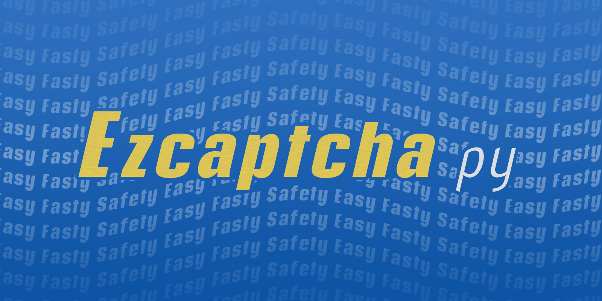

# Ezcaptcha



Ezcaptcha 项目官方中文文档，本文档托管于 [Github](https://github.com/JiangCX3/Ezcaptcha-Chinese-Document) 。

--------
# 概述

Ezcaptcha是一个**强大而又简易**的Python验证码图片生成库，
它不仅可以帮助用户在短时间内快速生成验证码图片，而且能自定义验证码的风格。

--------

**Ezcaptcha仍处于开发阶段** 

我们正在快速成长, 但是文档仍然需要完善, 软件本身也有一些不完善的地方。 2.0
版本计划在未来几周内发布。

--------
<span style="color:#2980b9;font-size:18px;">
  方便快捷
</span>

仅仅一句话，就可以快速生成验证码图片。

<span style="color:#2980b9;font-size:18px;">
  自定风格
</span>

提供一个强大而又简单的自定义样式接口，你可以用它来创建更安全、更漂亮的验证码图片。

<span style="color:#2980b9;font-size:18px;">
  高安全性
</span>

内置多个扭曲和干扰算法，帮助您对抗一般甚至是深度学习图像识别。

--------

# 获得

支持Python版本 >= 3.5

**使用pip安装（推荐）：**
```
pip install ezcaptcha 
```

下载安装包：

[稳定版](https://github.com/JiangCX3/Ezcaptcha/releases/latest) |
[最新版](https://github.com/JiangCX3/Ezcaptcha/releases/latest)

Github主页:
[https://github.com/JiangCX3/Ezcaptcha](https://github.com/JiangCX3/Ezcaptcha)

--------

# 开始

## > 最简单的方法

该函数可以让你在**最短时间内生成出一张验证码图片**，并返回为PIL.Image对象。

```python
import ezcaptcha

img = ezcaptcha.easy_get()
img.show()
```


以下是 `ezcaptcha.easy_get()` 函数的完整参数：

```python
ezcaptcha.easy_get(
        width = 400,
        height = 200,
        length = 4,     # 验证码长度
        complexity = 5, # 复杂度，数值为1-10之间
)
```

`complexity` 参数在1~10之间。


更多关于本函数:
[ezcaptcha.easy_get()](../../documents/document/#ezcaptchaeasy_get)


## > 一般的使用方法

使用`get_img()`生成一张验证码图片，然后再show()它。

```
import ezcaptcha

ezcaptcha.get_img().show()
```

## > 自定义风格
 
Ezcaptcha提供了一个强大的自定义风格接口，您可以利用这些接口来创建更安全、
更漂亮的验证码图片。接口在使用上十分简单，它允许作为一个*Dict*对象直接传入*get_img()*函数，
也可以作为一个配置文件保存在您的项目中。

**直接使用：**

```python
import ezcaptcha

styles = {

    "background"    : "#ffffff",    # 背景颜色
    "background-img": "",           # 背景图片
    
    # =====干扰纹理的样式配置=====
    "disturbs": {    
        "fonts"  : [    # 将会用到的字体
            "Nunito-Regular.ttf",
        ],           
        "colors" : [    # 将会用到的颜色
            "#FF9966", 
            "#663399", 
            "#003366"
        ], 
        "waves-amplitude": 10,  # 波浪变形：波幅
        "waves-wavelength": 20, # 波浪变形：波长
        "emp-level"  : 18,      # 电磁干扰变形：等级
        "zebra-level": 8,       # 条状变形：等级
        "zebra-width": 10,      # 条状变形：条宽度
    },
    
    # ===== 验证文本的样式配置 =====
    "text": {           
        "fonts"  : [    # 将会用到的字体
            "Nunito-Regular.ttf",
        ],           
        "colors" : [    # 将会用到的颜色
            "#FF9966", 
            "#663399", 
            "#003366"
        ], 
        "waves-amplitude": 10,  # 波浪变形：波幅
        "waves-wavelength": 20, # 波浪变形：波长
        "emp-level"  : 18,      # 电磁干扰变形：等级
        "zebra-level": 8,       # 条状变形：等级
        "zebra-width": 10,      # 条状变形：条宽度
    }
    
}

ezcaptcha.get_img(styles=styles).show()
```

**使用配置文件：**

请参考 [配置文件文档]()

**注意：仅 `ezcaptcha.get_img()`支持Styles参数。**


## > 将图片保存到路径

```python
import ezcaptcha

img = ezcaptcha.get_img()
img.save_to_path(path="./1.png")
```


## > 获得图片的base64代码

```python
import ezcaptcha

img = ezcaptcha.get_img()
img_base64 = img.get_base64()
```
